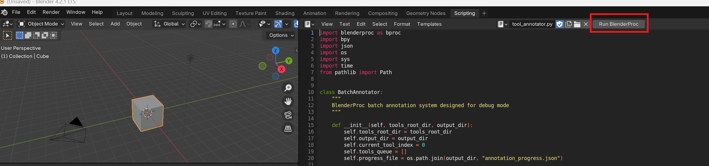
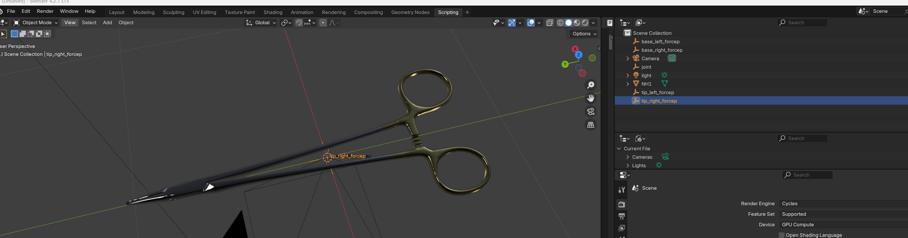
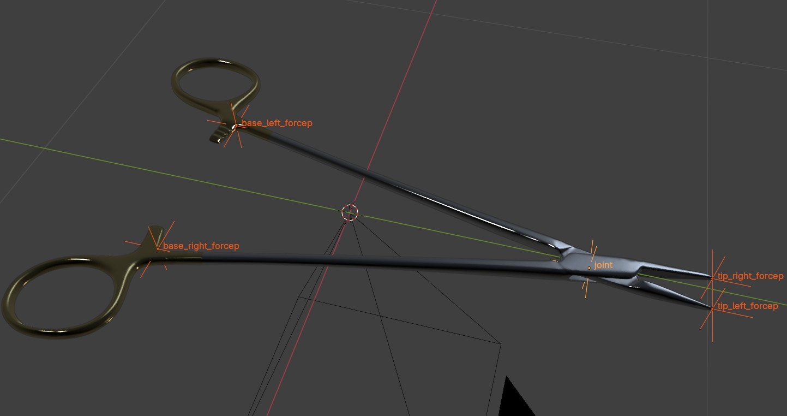
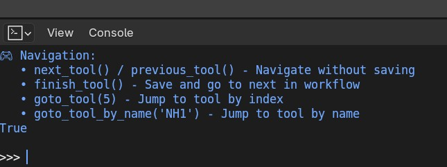

# Surgical Tool Keypoint Annotator

## Overview

This is a BlenderProc-based interactive system for manually annotating 3D surgical instrument models with keypoint landmarks.

## Prerequisites

- **3D Models**: Surgical instrument .obj files organized by tool type
- **Output Directory**: Write permissions for saving annotations
- **Tool Skeleton File**: `tool_skeletons.json` defining keypoint structures for each tool type

## Directory Structure

Your 3D models should be organized as follows:

```
surgical_tools_models/
├── needle_holder/
│   ├── NH1.obj
│   ├── NH2.obj
│   └── ...
├── tweezers/
│   ├── TW1.obj
│   └── ...
├── forceps/
│   ├── FP1.obj
│   └── ...
└── ...
```

### Tool Skeleton File

The `tool_skeletons.json` file defines the standard keypoint structure for each tool type. This file should be created manually before starting annotation and will be used to automatically create keypoints for new tools.

**Example skeleton structure:**
```json
{
  "needle_holder": {
    "keypoints": ["base_left_forcep", "base_right_forcep", "joint", "tip_left_forcep", "tip_right_forcep"],
    "skeleton": [
      ["base_left_forcep", "joint"],
      ["base_right_forcep", "joint"], 
      ["joint", "tip_left_forcep"],
      ["joint", "tip_right_forcep"]
    ],
    "flip_pairs": [
      ["base_left_forcep", "base_right_forcep"],
      ["tip_left_forcep", "tip_right_forcep"]
    ]
  }
}
```

**Skeleton Components:**
- **keypoints**: Array of keypoint names for the tool type
- **skeleton**: Connections between keypoints (for visualization)
- **flip_pairs**: Symmetric keypoints that can be flipped during annotation

### Creating Your Skeleton File

Before starting annotation, create a `tool_skeletons.json` file in your annotations directory:

1. **Identify Tool Types**: List all surgical instrument types you'll be annotating
2. **Define Keypoints**: For each tool type, list the anatomical landmarks
3. **Plan Connections**: Define which keypoints should be connected (for visualization)
4. **Mark Symmetries**: Identify pairs of keypoints that are mirror images

## Quick Start

### 1. Launch Blender with BlenderProc

```bash
# Basic usage (uses tool_skeletons.json from annotation directory)
blenderproc debug tool_annotator.py <tools_dir> <output_dir>

# With custom skeleton file
blenderproc debug tool_annotator.py <tools_dir> <output_dir> <path_to_skeleton_file>
```

**Arguments:**
- `tools_dir`: Directory containing surgical tool .obj files
- `output_dir`: Directory to save annotations
- `skeleton_file` (optional): Path to tool_skeletons.json file
  - Default: uses `tool_skeletons.json` from the same directory as the script

**Examples:**
```bash
# Use default skeleton file from annotation directory
blenderproc debug tool_annotator.py /path/to/tools /path/to/annotations

# Use custom skeleton file
blenderproc debug tool_annotator.py /path/to/tools /path/to/annotations /path/to/custom_skeletons.json

# Windows example with default skeleton
blenderproc debug tool_annotator.py "C:\data\tools" "C:\data\annotations"

# Windows example with custom skeleton
blenderproc debug tool_annotator.py "C:\data\tools" "C:\data\annotations" "C:\data\my_skeletons.json"
```

### 2. Start Annotation Session
The Run the python Script in the opened Blender window.




The system will automatically:
- Scan your tools directory
- Load the first unannotated tool
- Display annotation instructions
- Show progress information

### 3. Annotate Keypoints

**Automatic Keypoint Creation:**
The system automatically creates keypoints based on your `tool_skeletons.json` file. You only need to position them correctly.


**Manual Keypoint Creation (Alternative):**
1. **Add Keypoints**: `Shift + A` → `Empty` → `Plain Axes`
2. **Position Keypoints**: Move each empty to important landmarks
3. **Rename Keypoints**: `F2` to rename with descriptive names

**Final Step:**
4. **Position Keypoints**: Move automatically created keypoints to correct anatomical locations

5. **Save Annotations**: Use `finish_tool()` in Python console

**Important** : Run the commands in the blender console:


## Console Commands

### Core Functions

| Command | Description |
|---------|-------------|
| `finish_tool()` | Save current tool and move to next |
| `skip_tool()` | Skip current tool without saving |
| `show_status()` | Display progress information |

### Navigation (Without Saving)

| Command | Description |
|---------|-------------|
| `next_tool()` | Go to next tool |
| `previous_tool()` | Go to previous tool |
| `goto_tool(5)` | Jump to tool by index (0-based) |
| `goto_tool_by_name('NH1')` | Jump to tool by name |

### Utility Functions

| Command | Description |
|---------|-------------|
| `rescale_tool(2.0)` | Make tool bigger for better visibility |
| `rescale_tool(0.5)` | Make tool smaller |
| `list_references()` | Show available reference tools |
| `transfer_keypoints('NH1')` | Copy keypoints from reference tool |

### Tool Management

| Command | Description |
|---------|-------------|
| `list_completed()` | Show all completed tools |
| `list_all_tools()` | Show all tools with status |
| `load_tool_for_editing('NH1')` | Load specific tool for editing |
| `unmark_completed('NH1')` | Remove completed status |

## Advanced Features

### Keypoint Transfer

Copy annotations from previously annotated tools:

```python
# List available references for current tool type
list_references()

# Transfer keypoints from a reference tool
transfer_keypoints('NH1')
```

### Tool Editing

Edit previously completed annotations:

```python
# Load a completed tool for editing
load_tool_for_editing('NH1')

# Make changes, then save
finish_tool()

# Or unmark as completed to re-enter workflow
unmark_completed('NH1')
```

### Progress Management

The system automatically saves progress to `annotation_progress.json`:

```json
{
  "current_tool_index": 3,
  "completed_tools": ["NH1", "NH2", "TW1"],
  "total_tools": 8,
  "last_updated": "2024-01-15 14:30:25"
}
```

## Output Files

### JSON Annotations

Each tool generates a `{tool_name}_keypoints.json` file:

```json
{
  "tool_name": "NH1",
  "tool_type": "needle_holder",
  "obj_file": "/path/to/NH1.obj",
  "keypoints": {
    "jaw_left": {"x": 0.1, "y": 0.2, "z": 0.0},
    "jaw_right": {"x": -0.1, "y": 0.2, "z": 0.0},
    "joint": {"x": 0.0, "y": 0.0, "z": 0.0},
    "handle_end": {"x": 0.0, "y": -0.3, "z": 0.0}
  },
  "keypoint_names": ["jaw_left", "jaw_right", "joint", "handle_end"],
  "num_keypoints": 4,
  "annotation_date": "2024-01-15 14:30:25"
}
```

### Blender Files

Each tool saves a `{tool_name}_annotated.blend` file containing:
- 3D model with proper positioning
- Keypoint empties with names
- Scene setup and lighting

## Example Workflow

### Complete Annotation Session

```bash
# 1. Start annotation session
blenderproc debug surgical_tool_annotator.py /data/tools /data/annotations

# 2. Annotate first needle holder (NH1)
# - Place keypoints: jaw_left, jaw_right, joint, handle_end
# - Save: finish_tool()

# 3. Annotate second needle holder (NH2)
# - Use keypoint transfer: transfer_keypoints('NH1')
# - Adjust positions as needed
# - Save: finish_tool()

# 4. Continue with other tool types
# - Use similar workflow for tweezers, forceps, etc.
# - Leverage keypoint transfer for efficiency
```
